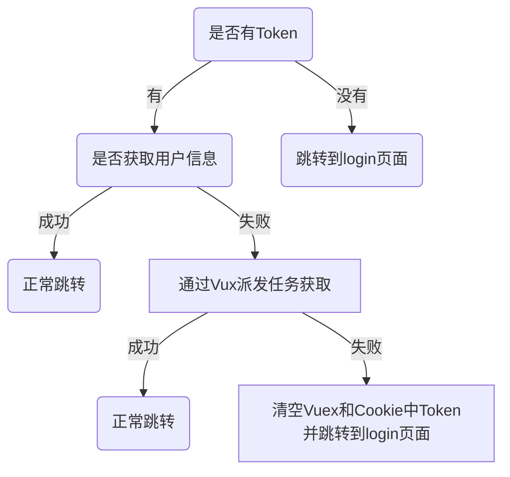

### Axios拦截器的主要功能

在Axios拦截器中，进行Token状态码的判断，

每次`请求`后端数据时，都向发送`Token`

后端`响应`数据时，判断是否返回错误状态码，如返回则清空`Vuex`和`Cookie`中的`Token`


### 登入页面

1. 向后端发生用户名+密码，如格式无误，则调用`Vuex`的`actions`

2. 在`actions`中请求后端验证
3. 验证成功后保存`Token`到`Cookie`
4. 再调用`mutations`保存`mutations`至`Vuex`的全局状态


验证失败则`actions`返回false，在login页面中提示失败信息


### 路由守卫

路由守卫中更多的是用来做权限验证，这里暂时只用来判断是否获取到Token及用户信息，获取到则正常跳转，没获取到则清空Token并跳转到login页面





### 代码风格

* Component：大写驼峰 如 `GlobalComponent/AreaPort`
* Js/View：短横线链接 如 `global-js/area-name.js或.vue`
* Assets：下横线链接 如 `global_imgs/area-name.jpg`


### 路由配置注意

view中的vue文件的name，需和当前route的配置name一致，不然在keep-alive中无法清空缓存

```js
// view/Home/index.vue 
export default {
    name:'Home'
}

//router/index.js
const router = [
 {
    path: '/',
    component: Layout,
    redirect: '/home',
    children: [{
      path: 'home',
      name: 'Home',		//name 与view中文件名一致
      component: () => import('@/views/home/index'),
      meta: { title: '我的首页', icon: 'el-icon-s-marketing' }
    }]
  }
]
```

