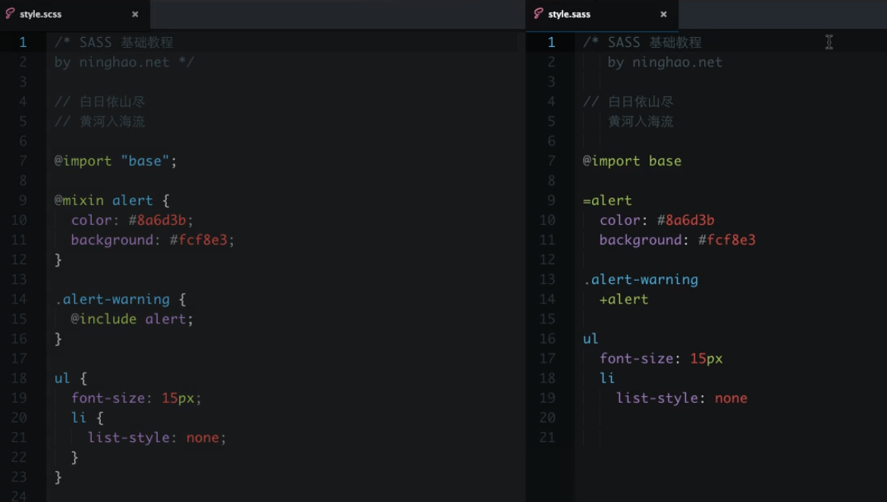

### Less的笔记


#### less的注释

* 以`//`方式注释，不会编译到css文件中
* 以`/**/`方式注释，会编译到css文件中


#### less中的变量

使用@来声明变量 `@var-color:#ccc;`

1. 作为普通属性值直接使用：`color:@var-color;`

2. 作为选择器和属性名：如ID选择器`#@{选择器名称}`

3. 作为URL：`background:url( @{URL} )`

4. less存在块级作用域

   ```less
   @var-color:#ccc;
   .box{
     color:@var-color;		//#ccc
     .inner{
       @var-color:red;
       color:@var-color;	//red
     }
   }
   ```

5. 变量的延迟加载

   ```less
   @var-color:;
   .box{
     color:@var-color;		//#ccc
     .inner{
       @var-color:red;
       color:@var-color;	//orange
       @var-color:orange;		
     }
   }
   //less是在所有页面解析完成后开始赋值的
   ```

   

#### less的嵌套规则

1. 基本嵌套规则

2. &的使用

   ```less
   //一般当前选择器使用伪选择器时，使用&符号
   .box{
     color:red;
     &:hover{		//.box:hover
       color:pink;
     }
     & &-text{		//.box .box-text
       font-size:16px;
    }
   }
   ```
   
   

#### less的自动编译

可以使用**vscode的插件：Easy Less**，按`ctrl+s`时自动生成对应css文件


#### less中的混合

混合就是将一系列属性从一个规则集引用到另一个规则集

1. 普通混合（样式不加括号，可以当做普通css引用）

   ```less
   .red-text{
     color:red;
     font-size:16px;
   }
   .box{
     .red-color;		//把red-text的样式集合一起引用过来
   }
   ```

2. 不带输出的混合（样式加上括号）

   ```less
   .red-text(){
     color:red;
     font-size:16px;
   }
   .box{
     .red-color;		//只能通过调用才能显示样式
   }
   ```

3. 带参数的混合

   ```less
   .red-text(@c,@f){
     color:@c;
     font-size:@f;
   }
   .box{
     .red-color(green,20px);		//传递参数
   }
   ```

4. 带默认值参数的混合

   ```less
   .red-text(@c:red,@f:16px){
     color:@c;
     font-size:@f;
   }
   .box{
     .red-color();
   }
   ```

5. 命名参数（就是指定某个形参，来进行传递）

   ```less
   .red-text(@c:red,@f:16px){
     color:@c;
     font-size:@f;
   }
   .box{
     .red-color(@f:25px);
   }
   ```

6. 匹配模式 （当css名字相同，位置不同时，就会用到匹配模式）

   ```less
   .triangle(@_,@w){		//公共样式，记得把形参也给加上
     width: 0px;
     height: 0px;
     border-style: solid;
   }
   .triangle(L,@w){		//匹配样式L
     border-width: @w ;
     border-color:transparent transparent  transparent red;
   }
   .triangle(R,@w){		//匹配样式R
     border-width: @w ;
     border-color:transparent red transparent transparent;
   }
   .box{
     .triangle(L,20px);
    }
   .other-box{
     .triangle(R,30px);
   }
   ```
   
7. argument变量 （就是一个属性集合，作用不大）

   ```less
   .border(@1,@2,@3){
     border:@arguments;
   }
   
   .box{
     .border(1px,solid,#ccc);
   }
   ```
   
   

#### less的计算

less可以进行加减乘除

**计算的一方带单位即可**

```less
.width(@a){
  width: @a;	//width:200px;
}
.box{
  .width(100+100px);
}
```


#### less的继承

**使用方式：**`extend(继承的类名)`

**与混合的区别：**

* 性能比混合高，灵活性比混合差
* 不能加括号及传递参数

```less
//要继承的样式
.fix-box{
  width: 50px;
  height: 50px;
}
//使用继承
.box p{
  &:extend(.fix-box);  //width:50px;height:50px;
  background:pink;
}
```


#### less的避免编译

当我们需要使用less原来的格式，不需要进行编译时，可以使用避免编译

```less
width: ~"cacl(100% - 10px)";
```


### Sass的笔记

#### 安装使用sass

这里直接按照[官网](https://www.sass.hk/install/)的安装步骤安装即可

#### 编译sass

* 使用命令行编译

  **伪代码：** ` sass  输入文件夹/scss文件名:输出文件夹/css文件名`

  ```js
  //示例
  // --watch  监视文件自动编译
  sass learnSass/test.scss:learnSass/test.css  --watch
  ```

  **输出格式：**

  如果要加输出格式，前面要加上`--style`，如`--style compact`

  * `nested`嵌套  （默认，如有嵌套向右缩进，以表示当前class下）
  * `compact`紧凑   （样式更紧凑些）
  * `expanded`扩展  （样式更易阅读）
  * `compressed`压缩  （所有样式为一行显示）

  

* 使用vscode的插件

  `Sass/Less/Scss/Typescript/Javascript/Jade/Pug Compile Hero Pro`或者`Live Sass Compiler`

#### 注释方式

sass中一共有三种注释方式

* ```scss
  /*
   *	我是注释
   */
  ```

* ```scss
  //	我在编译好后会消失
  ```

* ```scss
  /*!
   *	我是强注释，在编译模式为compressed中，上面两种注释都会消失，强注释不会！
   */
  ```

  

#### scss文件与sass文件的区别



这里以scss文件为标准，说明scss与sass的区别

* sass文件注释不用写回注释
* sass无需写`花括号{}`和`分号;`
* sass`mixin混合`只需写`=等号`
* sass导入只需写`+`

实际使用中，还是scss更为常用一些

#### 变量Variables

使用$来声明变量 `$var-color:#ccc;`

sass中变量存在块级作用域

```scss
$var-color:#ccc;
.box{
  color:$var-color;		//#ccc
  .inner{
    $var-color:red;
    color:$var-color;	//red
  }
}
```

#### 嵌套规则

> 除了属性嵌套，其他与less一致

1. 基本嵌套规则

2. &的使用

   ```less
   //一般当前选择器使用伪选择器时，使用&符号
   .box{
     color:red;
     &:hover{		//.box:hover
       color:pink;
     }
     & &-text{		//.box .box-text
       font-size:16px;
     }
   }
   ```

3. 嵌套属性

   ```scss
   //实际用途不大，还不如直接简写font和border
   .aaa{
     border: 1px solid #ccc{
       left:0;		//border-left: 0;
       right:0;	//border-right: 0;
     }
     font:{
       weight:bold;
       size:16px;
       family:'宋体';
     }
   }
   ```

#### 混合@mixin

> sass混合的使用方式

```scss
//定义mixin
@mixin 名字(参数1，参数2...){
  ...
}
//使用mixin
.box{
  @include 名字();  //括号可加可不加
}
```

1. 普通混合

   ```scss
   //示例
   @mixin red-font {
     color: red;
   }
   
   .box{
     @include red-font;
   }
   ```

2. 带参数的混合

   ```scss
   @mixin red-font($c , $b) {
     color: $c;
     background-color: $b;
     .inner{
       color: darken($c,10%);	//darken($color,$amount);  使颜色变暗
     }
   }
   
   .box{
     //@include red-font(red,#ccc);   
     @include red-font($c:red,$b:blue);   //定义被传递的参数名
   }
   ```

3. 参数默认值

   ```scss
   @mixin red-font($c:red , $b:#ccc) {
     color: $c;
     background-color: $b;
   }
   
   .box{
     @include red-font();   
   }
   ```

   

#### 继承@extend

> 把选择器中的样式继承到当前选择器

```scss
.red-font{
  color: red;
}
.red-font p{		
 font-weight: bold;
}
//继承
.box{
  @extend .red-font  //.red-font下的子元素也被继承
  background-color: #ccc;
}
```

```css
/*效果*/
.red-font, .box {
  color: red;
}

.red-font p, .box p {
  font-weight: bold;
}

.box {
  background-color: #ccc;
}
```

#### 导入@import

> 当我们需要模块化css时，就需要用到@import

我们一般用`下划线来命名__`文件，这样系统就会认为这个文件是一个Partials（分模块），不会单独编译这个Partial

1. 定义一个文件，如`_base.scss`;

2. 使用@import导入

   ```scss
   //导入时无需写文件名后缀，partial的下划线也可省略
   @import "base";
   ```

   

#### 数据类型——data type

> 检测数据类型

当我们在命令行中使用`sass -i`后，在命令行中输入代码可以实时看到当前sass的编译结果。

如输入`type-of(5)`，返回`"Number"`

```
type-of(5px)   -> "Number"
type-of(1px solid #ccc)   ->"list"
type-of(hello)   -> "String"
```


#### sass数字运算

> 我们都知道css有px，em，等单位，在scss中的数值单位是可以运算的，那么它们是如何运算的呢

当我们在命令行中使用`sass -i`，即可看到实时运算结果

* 加法 

  `3px+2`		=>5px

* 减法

  `3px-2`		=>1px

* 乘法

  `3px*2`		=>6px

* 除法  (除法比较特殊，因为/在css中属于分割属性，如`font:16px/1.8  serif;`，所以要用括号包裹起来进行运算)

  `(4px/2)`		=>2px

* 混合运算

  `3px+2*5`		=>13px

#### sass数字函数

函数可以参考JavaScript Math的方法

如取绝对值`abs(-10px)` 		=>10px

四舍五入` round(3.5px)`		=>4px

百分比`percentage(50px/100px)`		=>50%

#### sass字符串运算

1. 字符串不能进行相乘运算

2. 加法是两个字符拼接在一起

3. 减、除进行字符串运算，则把运算符也一起拼接进去


* 加法

  `a+b`  	=>"ab"

* 减法

  `a-b`  	=>"a-b"

* 除法

  `a/b` 	 =>"a/b"

#### sass运算符函数

我们在命令行中使用`sass -i`

```scss
//定义变量
$a:"Hi Sass"
//输出
"Hi Sass"  
```

```scss
//大写
to-upper-case($a)
//输出
"HI SASS"
```

```scss
//小写
to-lower-case($a) 
//输出
"hi sass"
```

```scss
//当前index
str-index($a,"Hi") 
//输出
1   //sass中index从1开始
```

```scss
//当前length
str-length($a) 
//输出
7
```

```scss
//插入字符
str-insert($a,"Code",8) //公有7个字符，所以我们在第8位插入
//输出
"Hi SassCode"
```

#### 颜色

颜色的表示方法

* 十六进制   `#ff0000`

* 英文颜色 `red`

* rgb (红绿蓝)  `rgb(255,0,0)`

  颜色的范围是0~255 ，也可以使用百分比表示，如`rgb(100%,0,0)`

* hsl (色相，饱和度，明度)  `hsl(0deg,100%,50%)`

  色相范围0~360deg  ，饱和度和明度的范围是0~100%

**注意：rgb和hsl后面都可以加上a，即多了一个属性：透明度**。如`hsla(0deg,100%,50%,0.5)`


#### 颜色函数

* adjust-hue  调整颜色的度数，即色相

  ```scss
  $base-color:blue;
  .box{
    color:adjust-hue($base-color,120deg);//red
  }
  ```

* lighten  增加明度

  ```scss
  $base-color:red;
  .box{
   	background-color: $base-color;		//red
    color:lighten($base-color,30%);	//#ff9999  颜色变亮
  }
  ```

* darken 减少明度

  ```scss
  $base-color:red;
  .box{
    background-color: $base-color;	//red
    color:darken($base-color,30%);	//#660000	颜色变暗
  }
  ```


* saturate 增加饱和度

  ```scss
  $base-color:hsl(100,50%,50%);
  .box{
    background-color: $base-color;	//#6abf40
    color:saturate($base-color,50%); //#55ff00   饱和度增加
  }
  ```

* desaturate 减少饱和度

  ```scss
  $base-color:hsl(100,50%,50%);
  .box{
    background-color: $base-color;	//#6abf40
    color:desaturate($base-color,30%); //#779966   饱和度减少
  }
  ```

* transparentize 增加透明度

  ```scss
  $base-color:hsla(100,100%,50%,0.5);
  .box{
    background-color: $base-color;		//rgba(85, 255, 0, 0.5)
    color:transparentize($base-color,0.3);	//rgba(85, 255, 0, 0.2)
  }
  ```

* opacify 增加不透明度

  ```scss
  $base-color:hsla(100,100%,50%,0.5);
  .box{
    background-color: $base-color;		//rgba(85, 255, 0, 0.5)
    color:opacify($base-color,0.3);		//rgba(85, 255, 0, 0.8);
  }
  ```

#### 列表

list的表现方式

* 空格分隔  `$colors:red pink #ccc`
* 逗号分隔  `$familys:Courier,宋体`
* 括号分隔  `$colors:(light:#fff,dark:#000)`

#### 列表函数

我们在命令行中使用`sass -i`

* 返回列表长度

  `length(5px 10px)`  	=>2

* 返回列表index的item

  `nth(5px 10px,1)` 		=>5px

* 返回当前item的index

  `index(5px 10px,5px)` 	=>1

* 列表加入item

  `append(5px 10px,15px)` 	=>5px 10px 15px

* 拼接列表

  `join(5px 10px,2px 3px,comma)` 	=>5px,10px,2px,3px


**注意：**`append`和`join`都有第三个参数，即拼接的符号，默认是空格`space`

**拼接符号：**空格`space`/逗号`comma`/自动`auto`

#### 列表中map函数

> 带key和value的列表

我们在命令行中使用`sass -i`

* 定义列表

  `$colors:(light:#fff,dark:#000)`		=>(light:#fff,dark:#000)

* 获取value

  `map-get($colors,dark)`		=>#000000

* 获取全部value

  `map-values($colors)`		=>(#ffffff, #000000)

* 获取全部的key

  `map-keys($colors)`		=>("light", "dark")

* 检测列表中是否有key

  `map-has-key($colors,light)`		=>true

* 合并列表

  `map-merge($colors,(dull-red:#bd0000))`		=>(light: #fff, dark: #000, dull-red: #bd0000)

* 移除项目

  ```scss
  map-remove($colors,light) 	 =>(dark: #000)
  map-remove($colors,light,dark)		=>()
  //移除或合并后，需要赋值给原属性才会生效
  $colors		=>(light:#fff,dark:#000)
  ```

  ```scss
  //移除并赋值
  $colors:map-remove($colors,light) 	 =>(dark: #000)
  $colors		=>(dark:#000)
  ```

  

#### sass表达式

> sass可以使用运算符进行布尔值判断

判断语法

* 大于  `>`
* 小于  `<`
* 与运算 `and`
* 或运算  `or`
* 非运算  `not`

```scss
5px > 3px    =>true
(6px>3px) and (10px <1px)		=>false
not(6px<2px)		=>true
```


#### interpolation插入

> 使用interpolation可以在样式、属性、注释中，插入变量或表达式

```scss
$version:'0.0.1';

/*当前版本：#{$version} */		//当前版本：0.0.1

$name:'info';
$attr:'border';
.box-#{$name}{		//.box-info
  #{$attr}:'1px solid #ccc';		//border:'1px solid #ccc'
}
```

#### 控制指令

> 当我们需要根据一些条件来判断当前样式是否展示时，需要用到控制指令

##### @if

* 伪代码

  ```
  @if 条件{
    //...
  }@else if 条件{
    //..
  }@else{
  	//.
  }
  ```

* 示例

  ```scss
  $is-show : false;
  $theme : 'light';
  
  .box{
    @if $is-show{
      color: red;
    }@else if $theme == 'light'{   //=>  true   
      color: #ccc;
    }@else{
      color: pink;
    }
  }
  ```

  

##### @for

* 伪代码

  ```
  @for $var from <开始值> through <结束值> {
  	//...
  }
  ```

* 示例

  ```scss
  $num : 4;
  
  @for $i from 1 through $num{
    .col-#{$i}{
      width:100% / $num *$i;
    }
  }
  
  //生成
  .col-1 {
    width: 25%;
  }
  .col-2 {
    width: 50%;
  }
  .col-3 {
    width: 75%;
  }
  .col-4 {
    width: 100%;
  }
  ```

  

注意：through还可以替换成to。

through包含结束值。to不包含结束值

##### @each

* 伪代码

  ```
  @each $var in $list{
  	//...
  }
  ```

* 示例

  ```scss
  //列表有三种形式，这里我们用空格分隔
  @icon:sussess error warning;
  
  
  @each $icon in $icons {
    .icon-#{$icon}{
      background-image: url('./img/#{$icon}.jpg');
    }
  }
  ```

  

##### @while

> 和js中一样，在条件内会一直循环，需要我们手动停止

* 示例

  ```scss
  $i:3;
  
  @while $i > 0 {
    .item{
      width:10px*$i;
    };
    $i: $i - 1;
  }
  ```

  

#### 函数Function

* 示例

  ```scss
  $colors:(light:#fff,dark:#000);
  
  @function getColor($key){
    @return map-get($colors,$key)
  }
  
  .box{
    background-color: getColor(dark);		//#000
  }
  ```

  

#### 错误提示

我们可以使用`@warn`或`@error`的方式来对用户提示错误信息

```scss
$colors:(light:#fff,dark:#000);

@function getColor($key){
  @if not (map-has-key($colors,$key)){
    @warn '没有找到#{$key}这个key';
  }
  @return map-get($colors,$key)
}

.box{
  background-color: getColor(red);		//warn：没有找到red这个key
}
```

**区别：**

* @warn在控制台显示错误信息
* @error在编译好的代码中显示错误信息

